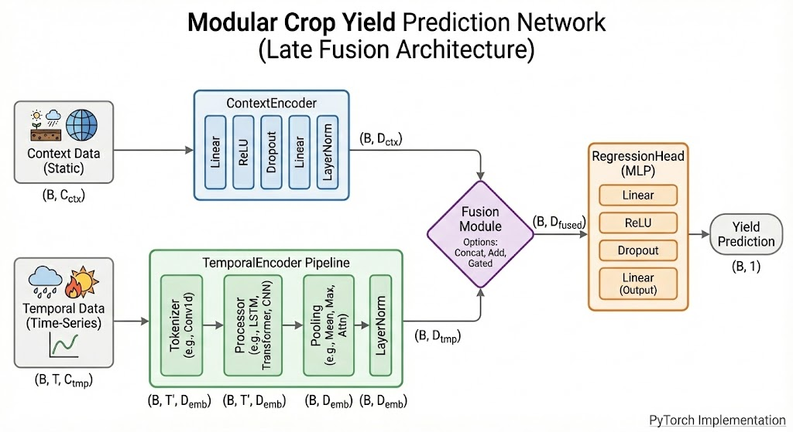

# PyTorch Trainer

To train neural network models using PyTorch, we construct a PyTorch Trainer - inspired by [HuggingFace's Trainer](https://huggingface.co/docs/transformers/main_classes/trainer) - 
to orchestrate the complex pipeline of PyTorch models creation, training and evaluation. This README shall motivate the 
choise of this implementation. Finally we go into the detail of an example for a torch model architecture.

## Why We Need a Trainer Class?

CY-Bench models use a unified interface where all models follow the same pattern:

```python
model.fit(dataset, **fit_params)
predictions, info = model.predict(dataset, **predict_params)
```

This works seamlessly for sklearn, XGBoost, and other ML libraries. However, PyTorch is fundamentally different—it's a **deep learning framework**, not just a model library.

Unlike `sklearn_model.fit()`, PyTorch requires orchestrating multiple components:
- **Training loops** over epochs and batches
- **DataLoaders** for streaming data
- **Optimizers** (Adam, SGD) for gradient updates
- **LR Schedulers** for learning rate adjustment
- **Loss functions** for computing gradients
- **Device management** (CPU/GPU)
- **Checkpointing** model and optimizer states

The **Trainer class** encapsulates this complexity while exposing the same simple `.fit()` and `.predict()` interface as other models. 

```python
trainer = TorchTrainer(
    model=,
    optimizer=,
    scheduler=,
    loss_fn=
)

trainer.fit(dataset)
predictions, info = trainer.predict(dataset)
```
⚠️ Possible Confusion: The Trainer class inherites from BaseModel (models/model.py) but itself is not a PyTorch model. The property `trainer.model` is a PyTorch model.

## Neural Network Models for CY-Bench

The neural network architecture in this repository aims to respect the underlying data structure of the CY-Bench dataset.
Each datapoint $x_i$ incorporates multiple datasource e.g. weather time series or soil data. Each source represents a 
modality that can flow into a predictive model. For the following network, we make a design choice that fundamentally 
simplifies the model input data, while not losing any information. We distinguish the data sources into static 
*context* data $x_i^{ctx}$ and *temporal* time-series $x_i^{ts}$ data. The context data is a vector of dimension $C_{ctx}$ 
that simply unites all features that have no time-dimension within a season, such as soil properties, location, harvest-year.
The time-series $x_i^{ts}$ on the other hand is represented as a matrix of the shape $T$x$C_{tmp}$ where each time-series 
is harmonized into the same temporal dimension $T$, either through averaging, interpolation or another technique. 

Furthermore, we process every sample $x_i$ in a dataset to match the very same dimensionality $T$ through having a unified
cutoff point. While this approach ignores potential diversity in the season length, it opens the door to a PyTorch-native
tensor representation of an entire batch of data of the shape ($B$x$T$x$C_{tmp}$). This tensor representation achieves
much faster data loading during training and inference.

Going from here, we can design a simple network architecture that builds upon a *Late-Fusion* of the two model inputs.
To achieve this fusion, both inputs have to be processed individually to generate a data representation that can be 
semantically merged. Therefore, we distinguish the *context*- and *temporal encoder* - two building blocks that aim to 
create information-dense latent representations.


Thanks NanoBanana!

### Context Encoder
The *context* or *static encoder* maps the context input $x_i^{ctx}$ into a latent space of dimension $D_{ctx}$. Since
we don't expect any further complexity from the stationary data, it appears appropriate to use a simple 
MLP for feature extraction. Finally, we apply layer normalization, which is further discussed on the fusion block.

### Temporal Encoder 
The *temporal encoder* handles environmental and remote-sensing time-series which are inherently auto-correlated. 
This brings the need for model architectures that are robust against auto-correlation. Models such as 1D-CNN, LSTM and
Mamba naturally excell in those environments, but also variations of the Transformer emerged as skillfull time-series models.
Transformers operate on *tokenized* data, which commonly takes patches of a time-series and projects them into a 
latent embedding vector. This block is referred to as a **tokenizer**. A similar approach was applied for LSTMs, in which 
a CNN-block extracts local feature, while the LSTM concentrates on connecting the whole time-series. 

This insight motivates the distinguishing of the temporal encoder into *tokenizer* and *processor*. The processor, or 
backbone, receives rich embeddings from the tokenizer, that have a much smaller dimension $T^|$ after the patching. For
example, if the patch size is set to 7, then $T^|$ would represent weekly instead of daily information like in $T$. A
processor's task is simply to draw temporally reasonable connections between the patches (or tokens if you want). 
This could be multi-layer CNN, LSTM or Transformer. 💡 Notably, one could imagine that a pretrained foundation model 
could be plugged into this architecture as a tokenizer or tokenizer & processor combined.

The processor outputs the data in the same format as it received it, so another block has to collapse the temporal 
dimension, to have a single vector representation. While mean- or max-pooling is common for CNNs, LSTMs usually just take
the last hidden state as an output. Another interesting approach is attention pooling that actively lets the network
decide which time-steps hold valuable information.

### Fusion
Fusing static and temporal data traditionally happens by a simple concatenation. However, the vast research on multi-modal
modeling shows that concatenation usually underperforms against the additive fusion methods. Therefore, the fusion block 
stands as a central model choice that influences how a model encodes and aligns different data sources.

### Regression Head
Well, its a MLP.